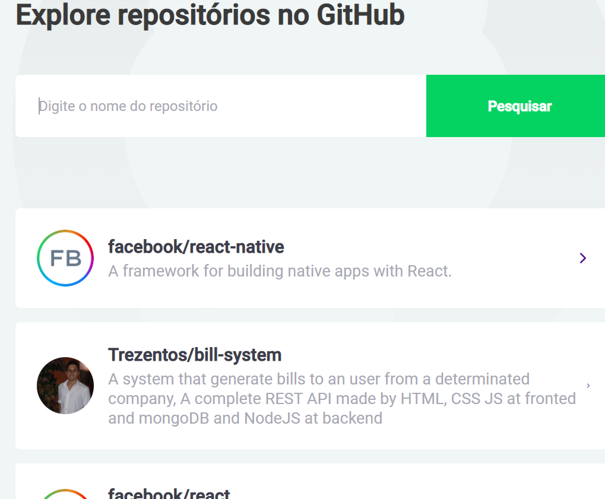
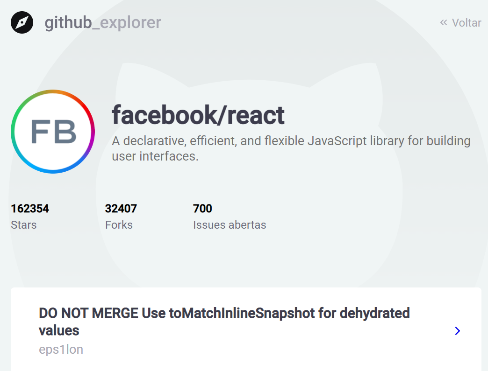

# Github_explorer

## In this web app we can research for another repositories through this bar.

For each repository that we research, the app list them for you

And when we click on a repository, the app show some infos about the repository clicked

You are being invited from me to clone this project and run yarn to check it out on you computer, I hope you enjoy it!

To run this project

1- Clone it
2- run yarn/npm install

